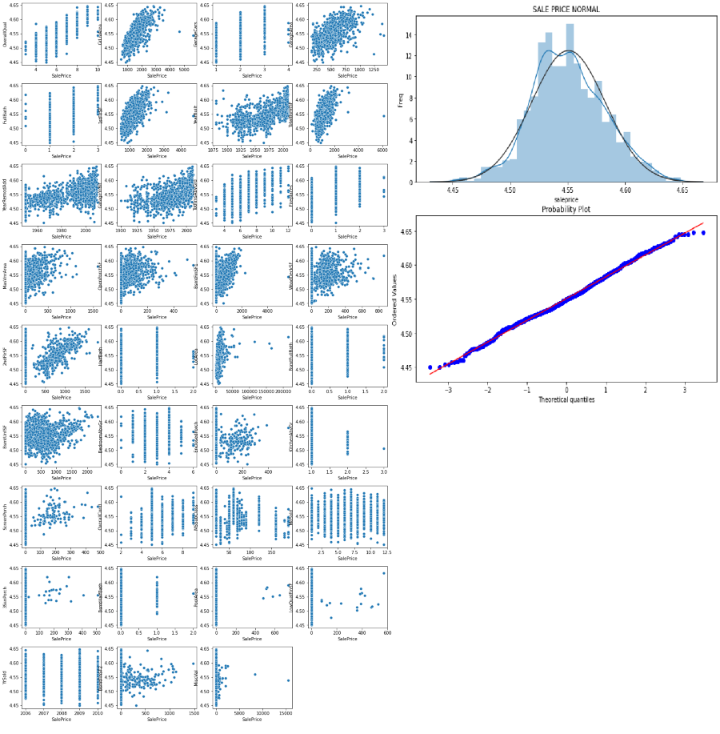
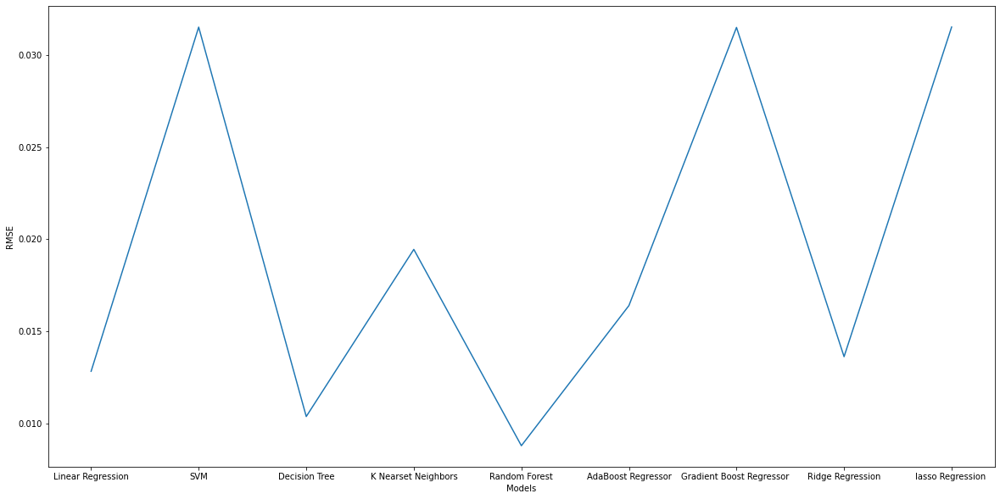

# Houses Price Prediction: Project Overview

* Created a tool that predict Houses Price (RMSE = **0.0076**) to help buyers knowing the sell price for the house when buying a house.
* Investigate more than **70** columns.
* Engineered features related to buying decision criteria.
* Optimized Linear, Lasso, Ridge, and Random Forest Regressors, Decision Tree Regressors, Support Vector Machine Regressor and more using GridsearchCV to reach the best model.
* Built a client facing API using FAST API. [App link!](https://house-sale-price.herokuapp.com "App link!"){:target="_blank"}

## Code ENV

**Python Version:** 3.9.2  
**Packages:** Pandas, Numpy, Sklearn, Matplotlib, Seaborn, FAST API, uvicorn, gunicorn

## Data Cleaning

After reading the data files, I needed to clean it up so that it was usable for our model. I made the following changes and created the following variables:

* Removed all columns with more than **15%** missing values to avoid misleading filling of null values.
* Normalized the dependent variables using box cox transformation due its good performance in skewed data.
* Selected features based on its person correlation factor.
* filled None values with zero.
* replaced outliers thats are out **3** times SD with mean.
* scaled numerical columns.
  
## EDA

I looked at distribution of independet variables and the dependent.

## Model Building

First, I split the data into train and tests sets with 80% to 20 respectively % with **5** folds for validation choosing **Root Mean Square error** (RMSE) as evaluation metric.

I started with linear regression as baseline then rest of eight models (SVM, Decision Tree, K Nearest Neighbors, Random Forest, AdaBoost Regressor, Gradient Boost Regressor, Ridge Regression and lasso Regression) where Random fores achived the best RMSE score with **0.0088** , **0.0076** in training and testing sets respectively.

Here is all model scores in the training set:

## Productionization

In this step, I built a FAST API endpoint that was hosted on heroku App website. The API endpoint takes in a request with a list of values from several parameters including house age and area  and returns an estimated price. [App link!](https://house-sale-price.herokuapp.com "App link!")
